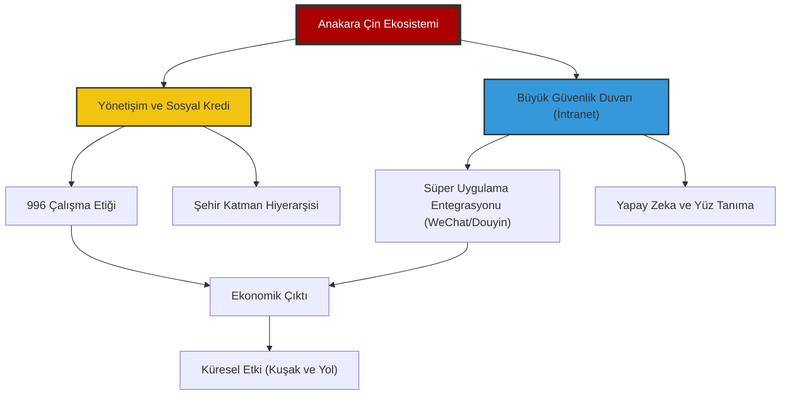

# 🐉 Proje: Çin Derin Analiz (Zhongguo Shenru)

> "Yarının dünyasını anlamak için sadece bugünün Çin verilerini değil, o verileri üreten binlerce yıllık makro mantığı ve Pekin'in teknolojik teleolojisini çözmek gerekir."

Bu repo, Çin Halk Cumhuriyeti'nin ekonomik, sosyal, teknolojik ve kültürel katmanlarını sadece betimlemekle kalmayıp, bu katmanlar arasındaki simbiyotik ilişkileri üst düzey analizlerle çözümleyen stratejik bir bilgi ekosistemidir. Sıradan bir dökümantasyonun çok ötesinde, Çin'in Batı merkezli paradigmalardan bağımsız olarak inşa ettiği "paralel evrenini" anlamaya, kodlarını deşifre etmeye ve bu devasa yapının küresel dengeler üzerindeki kaldıraç etkisini kavramaya yönelik masterclass seviyesinde bir rehberdir. Burada sunulan her bilgi, bir istihbari kırıntıdan ziyade, Pekin'in 2049 vizyonuna hizmet eden yapısal birer yapı taşı olarak ele alınmaktadır.

---

## 🏛️ Dijital Komuta Merkezi

Çin ekosistemi dört ana "Hakimiyet Alanı" altında kategorize edilmiştir. Her modül, kendi alanında sadece istatistiki dökümantasyon değil, aynı zamanda o alanın felsefi kökenlerini, modern uygulamalarını ve geleceğe yönelik projeksiyonlarını içeren görselleştirilmiş birer analiz merkezi olarak tasarlanmıştır.

| Hakimiyet Alanı | Analiz Alanı | Modül | Odak Alanı | Derinlik Seviyesi |
| :--- | :--- | :--- | :--- | :--- |
| [Sosyoloji](file:///c:/github%20repolar%C4%B1m/China-DeepDive/HAKIMIYET_SOSYOLOJI/README.md) | Toplumsal Mühendislik, Demografi & Spiritüalizm | **Deep Analysis** | Gümüş Ekonomi, Hukou Reformu & Neijuan | `MASTERCLASS` |
| [Teknoloji](file:///c:/github%20repolar%C4%B1m/China-DeepDive/HAKIMIYET_TEKNOLOJI/README.md) | NQPFs, Kuantum, Otonom Sistemler & Uç Sınırlar | **Transcendental** | Yeni Kaliteli Üretici Güçler & Derin Okyanus | `ULTRA-DEEP` |
| [Ekonomi](file:///c:/github%20repolar%C4%B1m/China-DeepDive/HAKIMIYET_EKONOMI/README.md) | Tedarik Zinciri Silahı, e-CNY & Kentsel Direnç | **Structural** | Ortak Refah & Çift Sirkülasyon | `ACTIVE / 2025` |
| [Kültür](file:///c:/github%20repolar%C4%B1m/China-DeepDive/HAKIMIYET_KULTUR/README.md) | Yeni Literati, Dijital İdeoloji & Modernite | **Transcendental** | Guo Chao, Yumuşak Güç & Sinisizasyon | `STABİL` |
| [Şablonlar](file:///c:/github%20repolar%C4%B1m/China-DeepDive/_TEMPLATES/) | Analitik Frameworkler & Araştırma Metodolojisi | **Operational** | Stratejik Intel & Red Line Protokolleri | `GELİŞTİRİLİYOR` |

---

## 🌍 Stratejik Bağlam: Makro Mantık

Modern Çin'i anlamak için Pekin'in mevcut yönetim paradigmasını oluşturan iki ana kavramı kavramak gerekir:

### 1. Yeni Kaliteli Üretici Güçler (Xingzhi Shengchanli)
Pekin'in "orta gelir tuzağı"ndan kaçış ve teknolojik egemenlik kurma konusundaki temel manifestosudur. Geleneksel, kaynak-yoğun ve düşük katma değerli üretim modellerinden radikal bir kopuşu ifade eden bu strateji; yapay zeka tarafından optimize edilmiş üretim hatlarını, kuantum haberleşmeyi, yeşil enerji ekosistemlerini ve biyoteknolojik devrimleri ekonominin ana motoru haline getirmeyi hedefler. Bu sadece bir endüstriyel güncelleme değil, üretimin doğasını "akıllı ve sürdürülebilir" bir forma büründürme girişimidir.

### 2. Çift Sirkülasyon (Shuang Xunhuan)
Çin'in küresel izolasyon risklerine ve dış yaptırımlara karşı geliştirdiği "ekonomik kale" stratejisidir.
- **İç Sirkülasyon (Hanehalkı Talebi):** 1.4 milyarlık devasa iç pazarı, yüksek teknoloji ürünlerinin birincil tüketicisi haline getirerek dışa bağımlılığı (özellikle kritik bileşenlerde) minimize etme ve yerli üreticiyi "ayakta kalabilir" kılma süreci.
- **Dış Sirkülasyon (Küresel Entegrasyon):** Küresel değer zincirlerindeki "stratejik boğum noktalarını" (limanlar, kritik madenler, standartlar) kontrol ederek dünyayı Çin'in üretim kapasitesine bağımlı kılma ve Pekin'in jeopolitik kozlarını güçlendirme hamlesi.

---

## 🏛️ Üst Düzey Strateji: 2049 Ufku ve Kırmızı Hatlar

Modern Çin'in tüm makro ve mikro hamleleri, 2049 yılında "tam gelişmiş, müreffeh ve güçlü bir sosyalist modern devlet" olma hedefine, yani "Büyük Çin Rönesansı"na odaklıdır.

### 🌌 2049 Vizyonu (Grand Strategy)
- **Teknolojik Egemenlik & Otonomi:** Kuantum bilişimden ay madenciliğine kadar her alanda Batı dökümantasyonuna ihtiyaç duymayan, kendi standartlarını dünyaya dikte eden bir teknoloji ekosistemi.
- **Jeopolitik Restorasyon:** Yüzyıllık aşağılanmanın (Century of Humiliation) ardından, Çin'in tarihsel "Zhongguo" (Orta Krallık) konumuna geri dönerek çok kutuplu dünyanın meşru ve dominant kutbu olması.
- **Toplumsal Refah & Ortaklık:** Kişi başı GSYİH'nın "orta düzeyde gelişmiş" ülkeleri aşması ve gelir adaletsizliğinin "Zeytin Tipi" (olive-shaped) bir modelle minimize edilmesi.

### 🛑 Dokunulamaz Kırmızı Hatlar (Red Lines)
Pekin'in küresel dengelerde "savaş nedeni" (casus belli) olarak gördüğü ve taviz vermeyeceği ontolojik alanlar:
1.  **Toprak Bütünlüğü & Tayvan:** "Tek Çin" prensibinin sadece diplomatik bir söylem değil, ulusal varoluşun kırmızı çizgisi olması.
2.  **Parti ve Sistem Meşruiyeti:** Çin Komünist Partisi'nin (ÇKP) yönetim tekelinin ve Çin tarzı sosyalizmin dokunulmazlığı.
3.  **Değerler Egemenliği:** Batı eksenli bireyselci insan hakları ve liberal demokrasi dayatmalarına karşı "kolektif güvenlik ve kalkınma öncelikli" modelin savunulması.
4.  **Kalkınma Hakkı:** Çin'in teknoloji ve ticaret alanındaki büyümesini engelleyecek her türlü yaptırımın, ulusal güvenlik tehdidi olarak kodlanması.

---

## 🧭 Navigasyon Metodolojisi

Bu repo, üç farklı okuma katmanı üzerinden tasarlanmıştır:

1.  **Seviye 1: Komuta Merkezi (Root):** Stratejik özetler ve makro bakış.
2.  **Seviye 2: Hakimiyet Alanları (Klasörler):** Tematik derinleşme, vaka çalışmaları ve güncel trendler.
3.  **Seviye 3: Stratejik Varlıklar (_ASSETS & _TEMPLATES):** Görsel diyagramlar ve araştırma şablonları.

---

## 🏗️ Modern Çin'in Yapısal Mantığı

Aşağıdaki diyagram, Çin'in toplumsal ve teknolojik işleyişindeki dikey entegrasyonu temsil eder:

---

## 🔍 Öne Çıkan Analizler: Derin Analiz

### 🧬 Toplum: Gümüş Ekonomi ve Sentetik Gelecek
Yaşlanan nüfusun yarattığı 30 Trilyon Yuan'lık "Gümüş Ekonomi" ve sentetik biyolojinin toplumsal gıda güvenliğindeki rolü.
- **Anahtar Kelimeler:** **Gümüş Ekonomi**, **Sentetik Biyoloji**, VR Bakım, Gaokao 2025.

### ⚡ Teknoloji: Uç Sınırlar ve Okyanus Egemenliği
1.5 Trilyon Yuan'lık "Düşük İrtifa Ekonomisi" (Drone/eVTOL) ve Arktik/Derin Deniz madenciliği (Meng Xiang).
- **Anahtar Kelimeler:** **Düşük İrtifa Ekonomisi**, **Derin Deniz Madenciliği**, Arktik Misyonu, NQPFs.

### 🏛️ Ekonomi: Kentsel Direnç ve Sünger Şehirler
İklim değişikliğine karşı "Sünger Şehir" altyapısı ve 2060 Karbon Nötr yolunda CCUS/Yeşil Hidrojen yatırımları.
- **Anahtar Kelimeler:** **Sünger Şehirler**, **Yeşil Hidrojen**, Karbon Yakalama, Ortak Refah.

### ⛩️ Kültür & İnanç: Pratik Spiritüalizm
Çin'de din, bir "kilise üyeliği" değil, günlük hayatın içine sızmış ritüeller bütünüdür.
- **Anahtar Kelimeler:** **Üç Öğreti (Budizm-Taoizm-Konfüçyüs)**, **Ata Kültü**, **Sinicization (Çinlileştirme)**.

---

## 🚀 Katkıda Bulunun

Bu merkez, topluluk desteğiyle büyür. Çin'in karmaşıklığını çözmemize yardım etmek için `CONTRIBUTING.md` dosyasını inceleyin.

---

    
<i>"Kızıl Ejder'in kodlarını çözüyoruz, her seferinde bir blok."</i>

