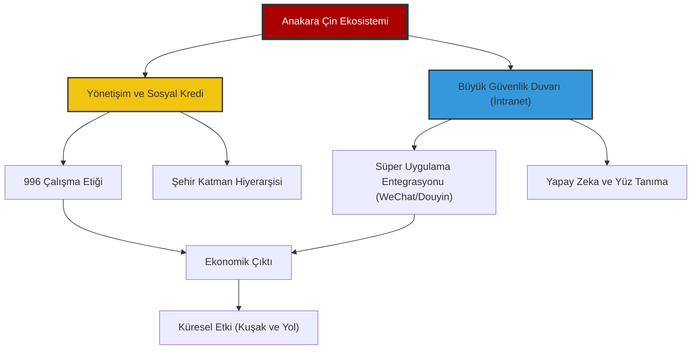

# 🐉 Proje: Çin Derin Analiz (Zhongguo Shenru)

> "Yarının dünyasını anlamak için bugünün Çin mantığını çözmek gerekir."

Bu repo, Çin Halk Cumhuriyeti'nin ekonomik, sosyal, teknolojik ve kültürel katmanlarını üst düzey analizlerle çözümleyen stratejik bir bilgi merkezidir. Sıradan bir dökümantasyonun ötesinde, Çin'in "paralel evrenini" anlamaya yönelik stratejik bir rehberdir.

---

## 🏛️ Dijital Komuta Merkezi

Çin ekosistemi dört ana "Hakimiyet Alanı" altında kategorize edilmiştir. Her modül, kendi alanında derinlemesine dökümantasyon ve görsel analizler içerir.

| Hakimiyet Alanı | Analiz Alanı | Modül | Odak Alanı | Derinlik Seviyesi |
| :--- | :--- | :--- | :--- | :--- |
| [Sosyoloji](file:///c:/github%20repolar%C4%B1m/China-DeepDive/HAKIMIYET_SOSYOLOJI/README.md) | Toplumsal Mühendislik & Demografi | **Elite** | Neijuan & Tang Ping | `DERİNLEMESİNE` |
| [Teknoloji](file:///c:/github%20repolar%C4%B1m/China-DeepDive/HAKIMIYET_TEKNOLOJI/README.md) | Kuantum, Yapay Zeka & Uzay | **Transcendental** | Yeni Kaliteli Üretici Güçler | `AKTİF` |
| [Ekonomi](file:///c:/github%20repolar%C4%B1m/China-DeepDive/HAKIMIYET_EKONOMI/README.md) | Tedarik Zinciri Silahı & e-CNY | **Elite** | Çift Sirkülasyon Stratejisi | `AKTİF` |
| [Kültür](file:///c:/github%20repolar%C4%B1m/China-DeepDive/HAKIMIYET_KULTUR/README.md) | Yeni Literati & Dijital İdeoloji | **Transcendental** | Yumuşak Güç & Modernite | `STABİL` |
| [Şablonlar](file:///c:/github%20repolar%C4%B1m/China-DeepDive/_TEMPLATES/) | İstihbarat ve Analiz Frameworkleri | **Operational** | Araştırma Metodolojileri | `GELİŞTİRİLİYOR` |

---

## 🌍 Stratejik Bağlam: Makro Mantık

Modern Çin'i anlamak için Pekin'in mevcut yönetim paradigmasını oluşturan iki ana kavramı kavramak gerekir:

### 1. Yeni Kaliteli Üretici Güçler (Xingzhi Shengchanli)
Geleneksel büyüme modellerinden (gayrimenkul ve düşük katma değerli üretim) kopup; kuantum bilişim, yeşil enerji ve biyoteknoloji gibi yüksek teknolojili alanlarda mutlak üstünlük kurma stratejisidir.

### 2. Çift Sirkülasyon (Shuang Xunhuan)
- **İç Sirkülasyon:** İç tüketimi ve yerli üretimi artırarak dışa bağımlılığı (özellikle Batı yaptırımlarına karşı) minimize etme.
- **Dış Sirkülasyon:** Küresel ticaret ağlarını (Kuşak ve Yol gibi) kullanarak Çin'in jeopolitik etkisini konsolide etme.

---

## 🏛️ Üst Düzey Strateji: 2049 Ufku ve Kırmızı Hatlar

Modern Çin'in tüm hamleleri, 2049 yılında "tam gelişmiş, müreffeh ve güçlü bir sosyalist modern devlet" olma hedefine (Yüzüncü Yıl Hedefi) odaklıdır.

### 🌌 2049 Vizyonu (Grand Strategy)
- **Teknolojik Egemenlik:** Kuantum, yapay zeka ve biyoteknolojide mutlak küresel liderlik.
- **Jeopolitik Restorasyon:** Çin'in tarihsel "Orta Krallık" konumuna geri dönmesi ve çok kutuplu dünyada ana kutup olması.
- **Orta Sınıf Refahı:** Kişi başı GSYİH'nın orta düzeyde gelişmiş ülkeler seviyesine çıkarılması.

### 🛑 Dokunulamaz Kırmızı Hatlar (Red Lines)
Pekin'in uluslararası ilişkilerde taviz vermeyeceği dört temel alan:
1.  **Tayvan Meselesi:** "Tek Çin" prensibinin sarsılmazlığı.
2.  **Siyasi Sistem:** Çin Komünist Partisi'nin (ÇKP) yönetim meşruiyeti ve liderliği.
3.  **Demokrasi ve İnsan Hakları:** İç işlerine müdahale olarak görülen Batılı değer dayatmaları.
4.  **Kalkınma Hakları:** Çin'in teknoloji ve ticaret alanındaki büyümesinin engellenmeye çalışılması (Yaptırım ve tarifeler).

---

## 🧭 Navigasyon Metodolojisi

Bu repo, üç farklı okuma katmanı üzerinden tasarlanmıştır:

1.  **Seviye 1: Komuta Merkezi (Root):** Stratejik özetler ve makro bakış.
2.  **Seviye 2: Hakimiyet Alanları (Klasörler):** Tematik derinleşme, vaka çalışmaları ve güncel trendler.
3.  **Seviye 3: Stratejik Varlıklar (_ASSETS & _TEMPLATES):** Görsel diyagramlar ve araştırma şablonları.

---

## 🏗️ Modern Çin'in Yapısal Mantığı

Aşağıdaki diyagram, Çin'in toplumsal ve teknolojik işleyişindeki dikey entegrasyonu temsil eder:

---

## 🔍 Öne Çıkan Analizler: İstihbarat Özetleri

### 🧬 Toplum: Büyük İçsel Sarmal (Neijuan)
Çinli gençlerin "aşırı rekabet ama düşük getiri" sarmalına girmesi. Neden herkes aynı anda koşuyor ama kimse ilerleyemiyor?
- **Anahtar Kelimeler:** Tang Ping, Bai Lan, **Hukou Sistemi (Görünmez Duvarlar)**.

### ⚡ Teknoloji: EV Yıldırım Harbi & Siber Bağımsızlık
Çin'in içten yanmalı motorları atlayıp doğrudan Batarya ve Yazılım odaklı araçlarda dünyayı nasıl domine ettiği.
- **Anahtar Kelimeler:** BYD, CATL, **G60 Yıldız Geçidi**, **RISC-V Pivotu**.

### 🏛️ Ekonomi: Emlak Ekseni Kayması & Dijital Yuan
Gayrimenkul odaklı büyümeden "Yeni Kaliteli Üretici Güçler"e geçişin sancıları.
- **Anahtar Kelimeler:** Evergrande, **LGFV Borç Sarmalı**, **Dijital Yuan (e-CNY)**.

### ⛩️ Kültür & İnanç: Pratik Spiritüalizm
Çin'de din, bir "kilise üyeliği" değil, günlük hayatın içine sızmış ritüeller bütünüdür.
- **Anahtar Kelimeler:** **Üç Öğreti (Budizm-Taoizm-Konfüçyüs)**, **Ata Kültü**, **Sinicization (Çinlileştirme)**.

---

## 🚀 Katkıda Bulunun

Bu merkez, topluluk desteğiyle büyür. Çin'in karmaşıklığını çözmemize yardım etmek için `CONTRIBUTING.md` dosyasını inceleyin.

---

    
<i>"Kızıl Ejder'in kodlarını çözüyoruz, her seferinde bir blok."</i>

