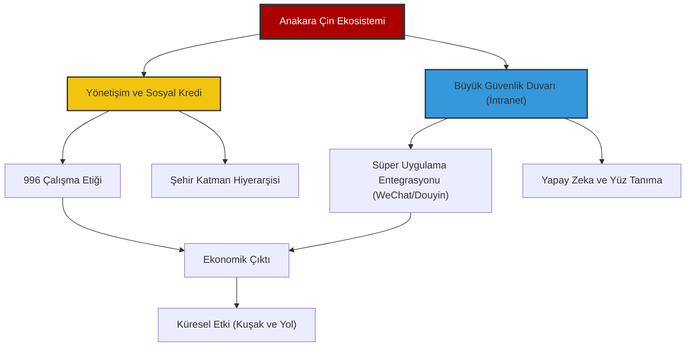

# 🐉 Proje: Çin Derin Analiz (Zhongguo Shenru)

> "Yarının dünyasını anlamak için sadece bugünün Çin verilerini değil, o verileri üreten binlerce yıllık makro mantığı ve Pekin'in teknolojik teleolojisini çözmek gerekir."

Bu repo, Çin Halk Cumhuriyeti'nin ekonomik, sosyal, teknolojik ve kültürel katmanlarını sadece betimlemekle kalmayıp, bu katmanlar arasındaki simbiyotik ilişkileri üst düzey analizlerle çözümleyen stratejik bir bilgi ekosistemidir. Sıradan bir dökümantasyonun çok ötesinde, Çin'in Batı merkezli paradigmalardan bağımsız olarak inşa ettiği "paralel evrenini" anlamaya, kodlarını deşifre etmeye ve bu devasa yapının küresel dengeler üzerindeki kaldıraç etkisini kavramaya yönelik masterclass seviyesinde bir rehberdir. Burada sunulan her bilgi, bir istihbari kırıntıdan ziyade, Pekin'in 2049 vizyonuna hizmet eden yapısal birer yapı taşı olarak ele alınmaktadır.

---

## 🏛️ Dijital Komuta Merkezi

Çin ekosistemi dört ana "Hakimiyet Alanı" altında kategorize edilmiştir. Her modül, kendi alanında sadece istatistiki dökümantasyon değil, aynı zamanda o alanın felsefi kökenlerini, modern uygulamalarını ve geleceğe yönelik projeksiyonlarını içeren görselleştirilmiş birer analiz merkezi olarak tasarlanmıştır.

| Hakimiyet Alanı | Analiz Alanı | Modül | Odak Alanı | Derinlik Seviyesi |
| :--- | :--- | :--- | :--- | :--- |
| [Sosyoloji](file:///c:/github%20repolar%C4%B1m/China-DeepDive/HAKIMIYET_SOSYOLOJI/README.md) | Sosyal Sosyal Restorasyon & Demografi | **Deep Analysis** | Gümüş Ekonomi & Kırsal Canlanma | `MASTERCLASS` |
| [Teknoloji](file:///c:/github%20repolar%C4%B1m/China-DeepDive/HAKIMIYET_TEKNOLOJI/README.md) | Füzyon, İnsansı Robotlar & Uç Sınırlar | **Transcendental** | NQPFs & Yapay Güneş | `ULTRA-DEEP` |
| [Ekonomi](file:///c:/github%20repolar%C4%B1m/China-DeepDive/HAKIMIYET_EKONOMI/README.md) | Havacılık, Katı Hal Batarya & Ekoloji | **Structural** | C919 & Ortak Refah | `ACTIVE / 2025` |
| [Kültür](file:///c:/github%20repolar%C4%B1m/China-DeepDive/HAKIMIYET_KULTUR/README.md) | Yeni Literati, Dijital İdeoloji & Modernite | **Transcendental** | Guo Chao, Yumuşak Güç & Modernite | `STABİL` |
| [Şablonlar](file:///c:/github%20repolar%C4%B1m/China-DeepDive/_TEMPLATES/) | Analitik Frameworkler & Araştırma Metodolojisi | **Operational** | Stratejik Intel & Red Line Protokolleri | `GELİŞTİRİLİYOR` |

---

## 🌍 Stratejik Bağlam: Makro Mantık

Modern Çin'i anlamak için Pekin'in mevcut yönetim paradigmasını oluşturan iki ana kavramı kavramak gerekir:

### 1. Yeni Kaliteli Üretici Güçler (Xingzhi Shengchanli)
Pekin'in "orta gelir tuzağı"ndan kaçış ve teknolojik egemenlik kurma konusundaki temel manifestosudur. Geleneksel, kaynak-yoğun ve düşük katma değerli üretim modellerinden radikal bir kopuşu ifade eden bu strateji; yapay zeka tarafından optimize edilmiş üretim hatlarını, kuantum haberleşmeyi, yeşil enerji ekosistemlerini ve biyoteknolojik devrimleri ekonominin ana motoru haline getirmeyi hedefler. Bu sadece bir endüstriyel güncelleme değil, üretimin doğasını "akıllı ve sürdürülebilir" bir forma büründürme girişimidir.

### 2. Çift Sirkülasyon (Shuang Xunhuan)
Çin'in küresel izolasyon risklerine ve dış yaptırımlara karşı geliştirdiği "ekonomik kale" stratejisidir.
- **İç Sirkülasyon (Hanehalkı Talebi):** 1.4 milyarlık devasa iç pazarı, yüksek teknoloji ürünlerinin birincil tüketicisi haline getirerek dışa bağımlılığı (özellikle kritik bileşenlerde) minimize etme ve yerli üreticiyi "ayakta kalabilir" kılma süreci.
- **Dış Sirkülasyon (Küresel Entegrasyon):** Küresel değer zincirlerindeki "stratejik boğum noktalarını" (limanlar, kritik madenler, standartlar) kontrol ederek dünyayı Çin'in üretim kapasitesine bağımlı kılma ve Pekin'in jeopolitik kozlarını güçlendirme hamlesi.

---

## 🏛️ Üst Düzey Strateji: 2049 Ufku ve Kırmızı Hatlar

Modern Çin'in tüm makro ve mikro hamleleri, 2049 yılında "tam gelişmiş, müreffeh ve güçlü bir sosyalist modern devlet" olma hedefine, yani "Büyük Çin Rönesansı"na odaklıdır.

### 🌌 2049 Vizyonu (Grand Strategy)
- **Teknolojik Egemenlik & Otonomi:** Kuantum bilişimden ay madenciliğine kadar her alanda Batı dökümantasyonuna ihtiyaç duymayan, kendi standartlarını dünyaya dikte eden bir teknoloji ekosistemi.
- **Jeopolitik Restorasyon:** Yüzyıllık aşağılanmanın (Century of Humiliation) ardından, Çin'in tarihsel "Zhongguo" (Orta Krallık) konumuna geri dönerek çok kutuplu dünyanın meşru ve dominant kutbu olması.
- **Toplumsal Refah & Ortaklık:** Kişi başı GSYİH'nın "orta düzeyde gelişmiş" ülkeleri aşması ve gelir adaletsizliğinin "Zeytin Tipi" (olive-shaped) bir modelle minimize edilmesi.

### 🛑 Dokunulamaz Kırmızı Hatlar (Red Lines)
Pekin'in küresel dengelerde "savaş nedeni" (casus belli) olarak gördüğü ve taviz vermeyeceği ontolojik alanlar:
1.  **Toprak Bütünlüğü & Tayvan:** "Tek Çin" prensibinin sadece diplomatik bir söylem değil, ulusal varoluşun kırmızı çizgisi olması.
2.  **Parti ve Sistem Meşruiyeti:** Çin Komünist Partisi'nin (ÇKP) yönetim tekelinin ve Çin tarzı sosyalizmin dokunulmazlığı.
3.  **Değerler Egemenliği:** Batı eksenli bireyselci insan hakları ve liberal demokrasi dayatmalarına karşı "kolektif güvenlik ve kalkınma öncelikli" modelin savunulması.
4.  **Kalkınma Hakkı:** Çin'in teknoloji ve ticaret alanındaki büyümesini engelleyecek her türlü yaptırımın, ulusal güvenlik tehdidi olarak kodlanması.

---

## 🧭 Navigasyon Metodolojisi

Bu repo, sadece bir bilgi deposu değil, Çin'in çok katmanlı gerçekliğini "dikey entegrasyon" prensibiyle anlamaya yönelik bir bilişsel haritadır. Her okuma seviyesi, farklı bir analitik derinliği temsil eder ve kullanıcının ihtiyaçlarına göre modeler olarak tasarlanmıştır:

## 🧭 Navigasyon Metodolojisi: Çok Katmanlı Analitik Çerçeve

Bu repo, sadece bir bilgi deposu değil, Çin'in çok katmanlı gerçekliğini "dikey entegrasyon" prensibiyle anlamaya yönelik bir bilişsel haritadır. Her okuma seviyesi, farklı bir analitik derinliği temsil eder ve kullanıcının ihtiyaçlarına göre modüler olarak tasarlanmıştır. Bu yapı, bilginin hem genişliğini hem de derinliğini aynı anda sunarak, farklı paydaşların (akademisyenler, stratejistler, iş insanları, politika yapıcılar) ihtiyaçlarına cevap verir.

1.  **Seviye 1: Komuta Merkezi (Root README.md):** Stratejik özetler, makro trendler ve "büyük resim" perspektifi. Karar vericiler ve yöneticiler için hızlı brifing noktası. Burada sunulan her bilgi, alt katmanlardaki binlerce sayfalık araştırmanın distile edilmiş özetidir. Bu katman, Çin'in küresel stratejisini, temel felsefesini ve ana hedeflerini kuşbakışı sunar.
2.  **Seviye 2: Hakimiyet Alanları (Tematik Modüller):** Sosyoloji, Ekonomi, Teknoloji ve Kültür gibi alanlarda derinlemesine dalgıçlık. Her modül, kendi alanında akademik düzeyde vaka çalışmaları, istatistiki analizler, tarihsel bağlam ve geleceğe yönelik projeksiyonlar sunar. Araştırmacılar ve analistler için birincil kaynak niteliğindedir. Bu katman, her bir hakimiyet alanının iç dinamiklerini, temel aktörlerini ve Çin'in genel stratejisine nasıl entegre olduğunu detaylandırır.
3.  **Seviye 3: Stratejik Varlıklar (_ASSETS & _TEMPLATES):** Görsel diyagramlar (Mermaid, infografikler), veri setleri, araştırma şablonları ve metodolojik kılavuzlar. Bu katman, ham bilgiyi "actionable intelligence" (eyleme dönüştürülebilir istihbarat) haline getirir. Strateji ekipleri ve politika analizçileri için operasyonel araçlar sunar. Bu seviye, analitik süreçlerin şeffaflığını ve tekrarlanabilirliğini sağlayarak, kullanıcıların kendi analizlerini yapmalarına olanak tanır.

---

## � Modern Çin'in Yapısal Mantığı: Dikey Entegrasyon Modeli

Aşağıdaki diyagram, Çin'in toplumsal, teknolojik ve ekonomik işleyişindeki "dikey entegrasyonu" temsil eder. Bu model, Batı'nın "yatay" (checks and balances) sisteminden radikal bir farklılaşmayı gösterir: Her katman, bir üst katmanın stratejik hedeflerine doğrudan hizmet eder ve geri bildirim döngüleri merkezi otorite tarafından optimize edilir. Bu yapı, merkeziyetçi kontrolü, verimliliği ve stratejik uyumu maksimize etmeyi hedefler.

### 🔍 Diyagram Analizi: Katmanlar Arası Sinerji ve Kontrol Mekanizmaları

Bu diyagram, Çin'in "sistemik rekabet" yaklaşımının temelini oluşturan entegre kontrol ve optimizasyon mekanizmalarını görselleştirir:

-   **Yönetişim Katmanı (B):** Sosyal Kredi Sistemi ve 996 çalışma düzeni, bireyleri "optimize edilmiş üretim birimleri" haline getirir. Bu, Batı'daki "bireysel özgürlük" paradigmasının tam zıttıdır: Kolektif hedefler, bireysel tercihlerden önceliklidir. Sosyal Kredi, vatandaşların ve şirketlerin davranışlarını merkezi olarak izleyip puanlayarak, "istenmeyen" davranışları caydırırken, "istenilen" davranışları teşvik eder. 996 çalışma kültürü (sabah 9'dan akşam 9'a, haftanın 6 günü), ulusal kalkınma hedeflerine ulaşmak için bireysel fedakarlığı yücelten bir ideolojinin yansımasıdır. Şehir Katman Hiyerarşisi ise kaynak dağılımını ve kalkınma önceliklerini merkezi olarak belirler.

-   **Dijital Ekosistem (C):** Büyük Güvenlik Duvarı, sadece bir sansür aracı değil, aynı zamanda Çin'in kendi "paralel internet" medeniyetini inşa etmesini sağlayan bir "dijital egemenlik" aracıdır. Bu duvar, Batı'nın bilgi akışını filtreleyerek, Çin'in kendi anlatısını ve ideolojisini korur. WeChat ve Douyin gibi süper uygulamalar, vatandaşların tüm dijital yaşamını (iletişim, ödeme, eğlence, haber) tek bir ekosistemde toplar, böylece veri toplama ve davranış yönlendirme maksimize edilir. Yapay Zeka ve Yüz Tanıma teknolojileri, bu dijital ekosistemin gözetim ve analiz kapasitesini katlayarak, sosyal kontrolü ve veri odaklı yönetimi yeni bir seviyeye taşır.

-   **Ekonomik Çıktı (D):** Yönetişim katmanının (B) ve dijital ekosistemin (C) optimize ettiği insan ve teknoloji kaynakları, devasa bir ekonomik çıktıya (D) dönüşür. Bu çıktı, sadece niceliksel değil, aynı zamanda Yeni Kaliteli Üretici Güçler (NQPFs) stratejisi doğrultusunda niteliksel olarak da dönüşmektedir. İç sirkülasyon, bu çıktının büyük bir kısmını iç pazarda tüketirken, dış sirkülasyon küresel entegrasyonu hedefler.

-   **Küresel Projeksiyon (E):** İç piyasada elde edilen ekonomik çıktı ve teknolojik üstünlük, Kuşak ve Yol Girişimi (BRI) gibi jeopolitik araçlarla dünyaya yayılır. Bu, sadece ticaret ve altyapı yatırımı değil, aynı zamanda "sistem ihracı" (exporting the system) olarak anlaşılmalıdır. Çin, kendi kalkınma modelini, teknolojik standartlarını ve yönetişim yaklaşımlarını küresel ölçekte yayarak, çok kutuplu dünya düzeninde kendi merkezini inşa etmeyi amaçlar.

---

## 🔍 Öne Çıkan Analizler: Derin Analiz

### 🧬 Toplum: Gümüş Ekonomi ve Kırsal Restorasyon
30 Trilyon Yuan'lık "Gümüş Ekonomi" potansiyeli ve köylerin dijitalleşerek (Taobao Villages) refaha entegre edilmesi süreci.
- **Anahtar Kelimeler:** **Gümüş Ekonomi**, **Kırsal Canlanma**, VR Bakım, Dijital Köyler.

### ⚡ Teknoloji: Füzyon, Robotlar ve Okyanus Sınırları
Seri üretim insansı robotlar, HL-3 Yapay Güneş projesi ve derin deniz madenciliği (Meng Xiang gemisi).
- **Anahtar Kelimeler:** **İnsansı Robotlar**, **HL-3 Füzyon**, Okyanus Madenciliği, NQPFs.

### 🏛️ Ekonomi: Havacılık Hamlesi ve Katı Hal Bataryalar
Boeing-Airbus düopolüne C919 yanıtı ve enerji depolamada "Katı Hal" (SSB) devrimi ile mutlak egemenlik.
- **Anahtar Kelimeler:** **C919 Havacılık**, **Katı Hal Batarya**, Sünger Şehirler, Ortak Refah.

### ⛩️ Kültür & İnanç: Pratik Spiritüalizm
Çin'de din, bir "kilise üyeliği" değil, günlük hayatın içine sızmış ritüeller bütünüdür.
- **Anahtar Kelimeler:** **Üç Öğreti (Budizm-Taoizm-Konfüçyüs)**, **Ata Kültü**, **Sinicization (Çinlileştirme)**.

---

## � Grafen ve İleri Malzemeler (Graphene & Advanced Materials)
- **Stratejik Önemi:** Grafen, süper iletkenlik, mekanik dayanıklılık ve termal özellikleriyle Çin'in nano‑malzeme liderliğini pekiştiriyor. 2025‑2030 hedefi, grafen tabanlı elektronik ve enerji depolama sistemlerini ölçeklendirmek.
- **Uygulama Alanları:** Yüksek hızlı veri iletimi, hafif kompozit yapılar, enerji depolama (süperkapasitörler) ve tıbbi sensörler.

## 🧬 CRISPR ve Gen Düzenleme (CRISPR & Gene Editing)
- **Stratejik Hedef:** 2025 itibarıyla CRISPR‑Cas9 tabanlı tarım ve sağlık çözümleriyle biyoteknoloji bağımsızlığı kazanmak.
- **Kritik Projeler:** Genetik hastalıkların tedavisi, dayanıklı tarım bitkileri ve biyoyakıt üretimi için gen düzenleme platformları.

## 🔋 Hidrojen Ekonomisi (Hydrogen Economy)
- **Vizyon:** 2030’a kadar hidrojen üretiminde %30 yenilenebilir enerji entegrasyonu ve yakıt hücresi taşıtlarıyla ulaşımda sıfır emisyon hedefi.
- **Altyapı:** Yeşil hidrojen elektroliz tesisleri, dağıtım ağları ve hidrojen yakıt istasyonları (H₂‑Station) geliştirme planları.

## 🌱 Dikey Tarım ve Gıda Güvenliği (Vertical Farming & Food Security)
- **Neden:** Kentsel nüfus artışı ve arazi kısıtlamaları nedeniyle yüksek verimli, su tasarruflu tarım sistemleri.
- **Teknolojiler:** LED spektrum kontrolü, IoT‑tabanlı ortam izleme ve yapay zeka destekli hasat optimizasyonu.

## 🏭 Akıllı İmalat 5.0 (Smart Manufacturing 5.0)
- **Amaç:** Endüstri 4.0 üzerine yapay zeka, dijital ikiz ve nesnelerin interneti (IoT) entegrasyonu ile tam otomasyon.
- **Kilit Bileşenler:** Dijital ikiz üretim hatları, otonom robotik kol sistemleri ve gerçek zamanlı veri analitiği.

---

## �🚀 Katkıda Bulunun

Bu merkez, topluluk desteğiyle büyür. Çin'in karmaşıklığını çözmemize yardım etmek için `CONTRIBUTING.md` dosyasını inceleyin.

---

    
<i>"Kızıl Ejder'in kodlarını çözüyoruz, her seferinde bir blok."</i>

